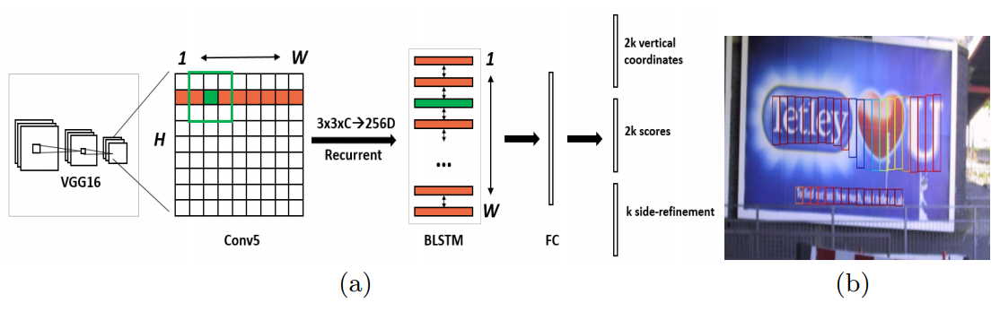
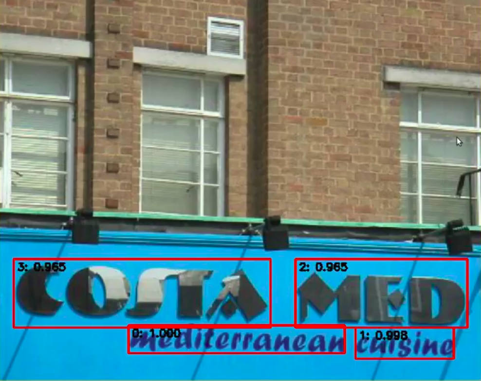
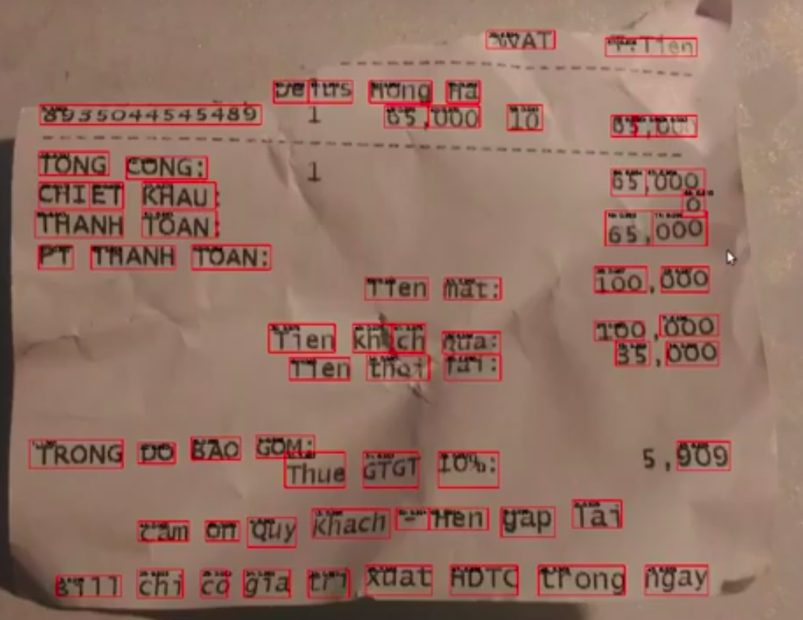
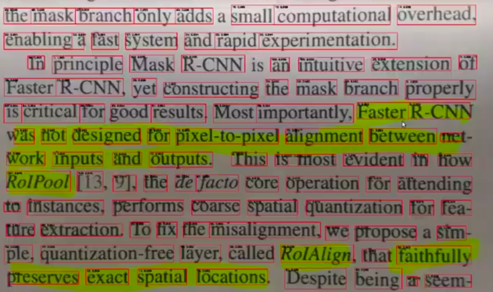

# CTPN-TensorFlow
A TensorFlow implementation of CTPN model for text detection problem

## General Information
- This is an implementation of the paper ["Detecting Text in Natural Image with Connectionist Text Proposal Network"](https://arxiv.org/abs/1609.03605)
- The CTPN detects a text line in a sequence of fine-scale text proposals directly in convolutional feature maps. The model uses a vertical anchor mechanism that jointly predicts location and text/non-text score of each fixed-width proposal, considerably improving localization accuracy. The sequential proposals are naturally connected by a recurrent neural network, which is seamlessly incorporated into the convolutional network, resulting in an end-to-end trainable model. This allows the CTPN to explore rich context information of image, making it powerful to detect extremely ambiguous text. The CTPN works reliably on multi-scale and multilanguage text without further post-processing, departing from previous bottom-up methods requiring multi-step post filtering.

<p align="center">
  
</p>

- Notice that the published implementation of the authors is not support side-refinement. In this implementation we replicate completely the CTPN with the full of compenents. Moreover, the original CTPN model only is able to detect texts at the level of a line of text. I proposed the new objective function and the corresponding modified LSTM part so that the new model can detect text at word level. The following images demonstrates of my implementation on real-life images.

<p align="center">
  
</p>

<p align="center">
  
</p>

<p align="center">
  
</p>

<p align="center">
  
</p>

- I mainly used TensorFlow 0.12 framework to implement the model.
- Further demonstration can be found at [here](https://www.youtube.com/watch?v=U3Kmdv9rrro).

### Datasets
There are two datasets which were used in my implementation:
- [ICDAR 2013](https://iapr.org/archives/icdar2013/index.html) which contains real-life images.
- [SynthText](http://www.robots.ox.ac.uk/~vgg/data/scenetext/) which artificially synthetic images.

Firstly, I train the model on a huge amount of synthetic images. Then I fine-tune the resulting model on a small number of real-life images.
In order to have better understanding my pre-processing steps, use can use the iPython notebook `data_utils/process_icdar_2013.ipynb`

## Instructions
### Build Dataset
In order to optimize the step of loading files in training and validation, we should convert the dataset (images and the corresponding sequencec of characters) into TF-Records.

Some arguments for building the dataset:
- `image_dir`: The path to the directory containing the images
- `imglist_file`: The path to file containing the labels for each image.
- `output_dir`: The directory containing the output dataset.
- `num_threads`: The number of threads used to build the dataset.
- `train_shards`: The number of TF-Record files for the training set.
- `val_shards`: The number of TF-Record files for the validation set.
- `test_shards`: The number of TF-Record files for the test set.

Then we could execute the following command to start building the dataset.
```bash
python build_dataset.py
```

### Train Model
In order to train a model, we execute the following command:
```bash
python train.py
```
Some critical arguments:
- `input_file_pattern`: The pattern of the tranining TF-Records.
- `vgg_checkpoint_file`: The path to the pretrained VGG-16 model. It can be downloaded at [here](http://download.tensorflow.org/models/vgg_16_2016_08_28.tar.gz).
- `ctc_ocr_checkpoint_file`: The path to the resulting checkpoints.
- `train_dir`: The path to the directory saving the results of the training (models and logs for TensorBoard).
- `build_dataset`: Flag indicates whether the VGG would be fine-tuned.
- `number_of_steps`: The maximum number of training steps.

### Evaluate Model
In order to evaluate a resulting model, we execute the following command:
```bash
python evaluate.py
```
Some critical arguments:
- `input_file_pattern`: The pattern of the tranining TF-Records.
- `checkpoint_dir`:  The path to the directory containing the resulting checkpoint.
- `eval_dir`: The path to the directory containing the results of the evaluation (logs for TensorBoard).
- `eval_interval_secs`: The time interval between evaluations.
- `num_eval_examples`: The number of data samples for each evaluation.

### Inference
In order to use a trained model to test a new image, we execute the following command:
```bash
python inference.py
```
Some critical arguments:
- `checkponit_path`: The path to the directory containing the trained model.
- `input_files`: The path to the directory containing the test images.

## Contact
Feel free to contact me (Ba-Hien TRAN) if you have any questions, either by [email](bahientranvn) or by issue.